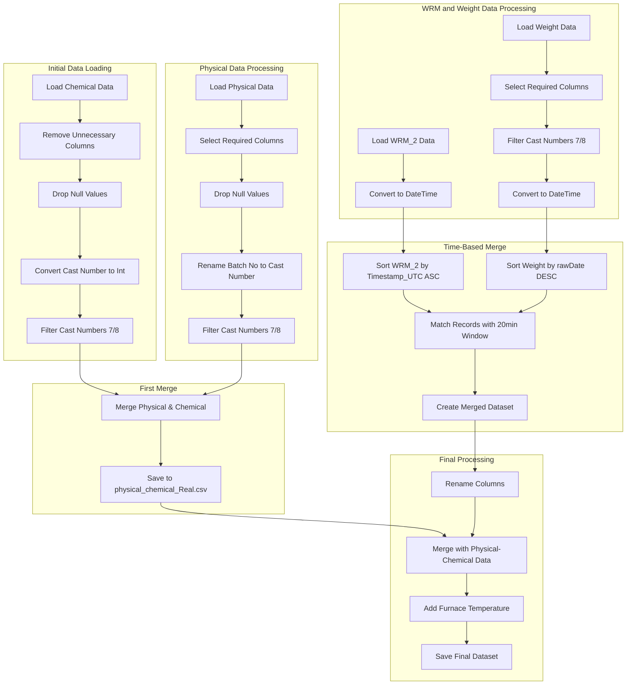

# Wire Rod Mill Data Processing Documentation

## Overview
This documentation describes the process of merging and analyzing data from multiple sources in a wire rod manufacturing process. The code combines data from chemical analysis, physical properties, weight measurements, and real-time production data to create a comprehensive dataset for analysis.

## Data Sources

### 1. WRM_2_DATA.xlsx
- Contains real-time production data from the second wire rod mill
- Includes temperatures, pressures, flows, and other operational parameters
- Timestamp in both local (Asia/Kolkata) and UTC formats

### 2. WEIGHT_DATA.xlsx
- Contains weight measurements and product identification data
- Key columns: castNo, coilNo, rawDate
- Measurements taken approximately 20 minutes after production

### 3. Wire Rod Chemical.xlsx
- Contains chemical analysis data
- Data linked to Cast Number
- Includes various chemical properties

### 4. Wire Rod Properties.xls
- Contains physical properties data
- Includes UTS, elongation, and conductivity measurements
- Data linked to Cast Number and Coil Number

## Process Flow

## Processing Steps

### 1. Chemical Data Processing
- Removes unnecessary columns (Posting Date, Stack No, Grade, Pcs, Sl No, Wt(MT))
- Drops rows with null values
- Converts Cast Number to integer format
- Filters for Cast Numbers starting with 7 or 8 (furnace numbers)

### 2. Physical Data Processing
- Selects required columns (Batch No, Coil, UTS, Elongation, Conductivity)
- Drops null values
- Renames 'Batch No' to 'Cast Number' for consistency
- Filters for Cast Numbers starting with 7 or 8

### 3. Initial Merge Operation
- Merges physical and chemical data using Cast Number as the key
- Uses left join to preserve all physical data records
- Saves intermediate result to 'physical_chemical_Real.csv'

### 4. WRM_2 and Weight Data Processing
- Processes weight data:
  - Selects relevant columns (castNo, coilNo, rawDate)
  - Filters for Cast Numbers starting with 7 or 8
- Converts timestamp columns to datetime format in both datasets

### 5. Time-Based Merge Operation
- Sorts WRM_2 data by Timestamp_UTC in ascending order
- Sorts weight data by rawDate in descending order
- Implements custom merge logic with 20-minute time window
- Creates comprehensive merged dataset

### 6. Final Data Creation
- Renames columns for consistency
- Merges with physical-chemical dataset
- Adds furnace temperature based on Cast Number prefix
- Saves final dataset to 'Real_final_Data_With_anomaly.csv'

## Important Notes

1. Cast Number Format:
   - Six-digit number
   - First digit indicates furnace number (7 or 8)
   - Used for product identification

2. Time Consideration:
   - 20-minute delay between production and weight measurement
   - Time adjustment implemented in merge logic

3. Data Quality:
   - Cast numbers may be incorrect due to manual entry
   - Null values removed during processing
   - Time-based matching used for accurate data correlation

## Output Files

1. physical_chemical_Real.csv:
   - Intermediate file containing merged physical and chemical properties

2. MERGED_OUTPUT.xlsx:
   - Intermediate file containing merged WRM_2 and weight data

3. Real_final_Data_With_anomaly.csv:
   - Final output file containing all merged data
   - Includes calculated furnace temperature

