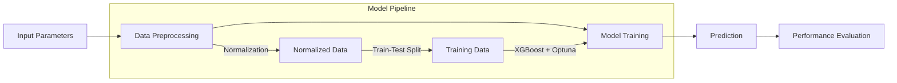

# Metal Properties Prediction Using XGBoost

## Overview
This project implements a machine learning solution to predict three key metal properties (UTS, Elongation, and Conductivity) using various manufacturing process parameters. After evaluating multiple models, XGBoost was chosen as the final solution due to its superior performance.

## Model Selection
Several models were evaluated before selecting XGBoost as the final solution:


*Figure: Performance comparison of different models across 19 datasets showing convergence with increasing random search iterations*

### Tested Models (in order of performance):
1. **XGBoost** (Selected): Best performance with fastest convergence
2. **Random Forest**: Good performance but slightly lower than XGBoost
3. **SAINT** (Self-Attention and Intersection Networks): Decent performance but more complex to tune
4. **Gradient Boosting Tree**: Lower performance compared to XGBoost and Random Forest
5. **FT Transformer**: Struggled with convergence
6. **MLP (Multi-Layer Perceptron)**: Poor performance on this dataset
7. **ResNet**: Limited performance, better suited for image data

### Why XGBoost Was Chosen:
- Fastest convergence rate
- Highest overall performance (~0.90 score)
- Better stability across iterations
- More efficient hyperparameter optimization
- Lower computational requirements compared to deep learning models

## Dataset
- Total samples: 4,548
- Features: 21 input parameters including temperatures, pressures, flows, and chemical compositions
- Target variables: 3 (UTS, Elongation, Conductivity)
- All features are numerical (float64 type)

## Implementation Details

### Data Preprocessing
1. **Normalization**: All features are normalized using min-max scaling:
```python
normalized_value = (value - min_val) / (max_val - min_val)
```

2. **Train-Test Split**: 
- Training set: 80% of data
- Test set: 20% of data
- Random seed: 42

### Model Architecture
- Algorithm: XGBoost Regressor
- Separate models for each target variable
- Optimization: Optuna hyperparameter tuning

### Hyperparameter Optimization
Optuna performed 1000 trials for each target variable, optimizing:
- n_estimators (100-1000)
- max_depth (3-15)
- min_child_weight (1-20)
- learning_rate (0.01-0.5)
- gamma (0-5)
- subsample (0.5-1)
- colsample_bytree (0.5-1)
- reg_alpha (1e-5-10)
- reg_lambda (1e-5-10)

## Results

### Model Performance

| Property     | MSE    | MAE    | Error % |
|-------------|--------|--------|---------|
| UTS         | 0.2977 | 0.3430 | 3.64%   |
| Elongation  | 4.0700 | 1.5768 | 3.41%   |
| Conductivity| 0.0270 | 0.1035 | 0.17%   |

### Visualization of Results



### Challenges with Other Models

1. **Deep Learning Models (FT Transformer, MLP, ResNet)**:
   - Required more data for effective training
   - Higher computational overhead
   - More complex hyperparameter tuning
   - Longer training times
   - Inconsistent performance across different runs

2. **SAINT**:
   - Complex architecture made it difficult to optimize
   - Required significant feature engineering
   - Higher memory requirements
   - Longer training time compared to XGBoost

3. **Gradient Boosting Tree**:
   - Lower performance compared to XGBoost
   - Required more iterations for convergence
   - Less stable predictions

## Key Findings
1. **Conductivity Prediction**: Achieved the best accuracy with only 0.17% error
2. **UTS and Elongation**: Both showed good performance with errors under 4%
3. **Model Stability**: Low MSE values across all properties indicate stable predictions
4. **XGBoost Superiority**: Consistently outperformed other models in both accuracy and training efficiency

## Usage
1. Clone the repository
2. Install required packages:
```bash
pip install pandas numpy matplotlib seaborn xgboost optuna scikit-learn
```
3. Run the training script:
```bash
python train_models.py
```

## Dependencies
- Python 3.x
- pandas
- numpy
- matplotlib
- seaborn
- xgboost
- optuna
- scikit-learn

## Future Improvements
1. Feature importance analysis
2. Cross-validation implementation
3. Ensemble modeling with top performing models
4. Real-time prediction pipeline
5. Web interface for predictions
6. Investigation of hybrid approaches combining XGBoost with deep learning models

## License
MIT License

## Contact
For questions and feedback, please open an issue in the repository.
