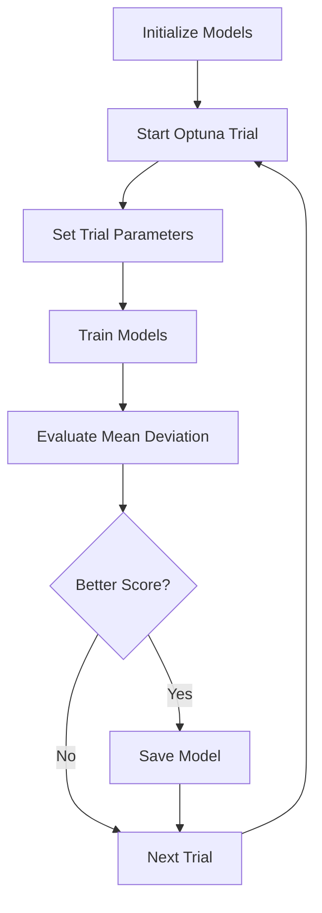

# CycleGAN Technical Documentation

## Overview
This implementation adapts the CycleGAN concept, specifically its loss functions and training methodology, for feature transformation between process parameters and material properties. While traditional CycleGAN was designed for image-to-image translation, this version has been significantly modified for numerical feature transformation.

## Architecture Modifications
> **Important Note**: This implementation does not use the traditional CycleGAN architecture. Instead, it adopts only the core concepts of cycle consistency and adversarial training while using a completely different neural network architecture optimized for numerical data.

### Key Differences from Original CycleGAN:
1. Replaced convolutional layers with fully connected layers
2. Simplified architecture for numerical feature processing
3. Modified input/output dimensions for feature vectors
4. Adapted normalization techniques for 1D data

## Network Architecture

### Generator:
```python
class Generator(nn.Module):
    def __init__(self, input_dim, output_dim):
        self.model = nn.Sequential(
            nn.Linear(input_dim, 128),
            nn.InstanceNorm1d(128),
            nn.LeakyReLU(0.2),
            nn.Linear(128, 256),
            nn.InstanceNorm1d(256),
            nn.LeakyReLU(0.2),
            nn.Linear(256, 128),
            nn.InstanceNorm1d(128),
            nn.LeakyReLU(0.2),
            nn.Linear(128, output_dim)
        )
```

### Discriminator:
```python
class Discriminator(nn.Module):
    def __init__(self, input_dim):
        self.model = nn.Sequential(
            nn.Linear(input_dim, 128),
            nn.InstanceNorm1d(128),
            nn.LeakyReLU(0.2),
            nn.Dropout(0.3),
            nn.Linear(128, 64),
            nn.InstanceNorm1d(64),
            nn.LeakyReLU(0.2),
            nn.Dropout(0.3),
            nn.Linear(64, 1),
            nn.Sigmoid()
        )
```

## Hyperparameter Tuning

### Optimized Parameters:
```python
Best Hyperparameters:
{
    'learning_rate': 7.565564532631836e-05,
    'batch_size': 15,
    'num_epochs': 148,
    'lambda_cycle': 17.01285413989663
}
```

### Tuning Process using Optuna:
```python
def objective(trial):
    # Hyperparameter search spaces
    learning_rate = trial.suggest_float('learning_rate', 1e-5, 1e-3, log=True)
    batch_size = trial.suggest_int('batch_size', 8, 64)
    num_epochs = trial.suggest_int('num_epochs', 10, 200)
    lambda_cycle = trial.suggest_float('lambda_cycle', 1, 20)
```

### Tuned Parameters:

1. **Learning Rate**:
   - Search space: 1e-5 to 1e-3 (log scale)
   - Optimal value: 7.57e-05
   - Impact: Controls optimization step size

2. **Batch Size**:
   - Search space: 8 to 64
   - Optimal value: 15
   - Impact: Affects training stability and memory usage

3. **Number of Epochs**:
   - Search space: 10 to 200
   - Optimal value: 148
   - Impact: Determines training duration

4. **Lambda Cycle**:
   - Search space: 1 to 20
   - Optimal value: 17.01
   - Impact: Weights the cycle consistency loss

### Optimization Strategy:
- Used Optuna for automated hyperparameter optimization
- Objective: Minimize mean deviation score
- Number of trials: 50
- Direction: Minimize
- Best achieved score: 0.1194854733

## Training Process



## Implementation Details

### Data Dimensions:
- Input Features: 16 dimensions (process parameters)
- Output Features: 3 dimensions (material properties)
- All features normalized to [0, 1] range

### Loss Functions:
1. **Adversarial Loss**: MSELoss
2. **Cycle Consistency Loss**: L1Loss
3. **Combined Loss**: 
   ```python
   G_loss = adversarial_loss + lambda_cycle * cycle_loss
   ```

### Training Configuration:
- Optimizer: Adam (β1=0.5, β2=0.999)
- Mixed Precision Training
- Model Checkpointing for Best Scores

## Results
- Mean Deviation Score: 0.1194854733
- Consistent performance across validation set
- Stable training with optimized hyperparameters

Would you like me to elaborate on any particular aspect or add more details about specific components?